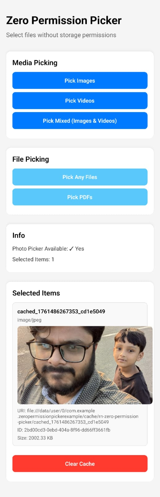
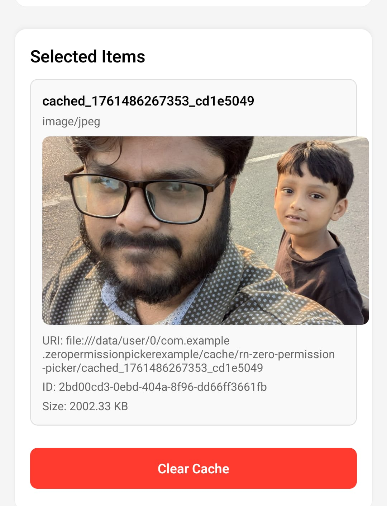

# react-native-zero-permission-picker

[](https://badge.fury.io/js/react-native-zero-permission-picker)
[](https://opensource.org/licenses/MIT)
[](https://www.typescriptlang.org/)
[](https://www.npmjs.com/package/react-native-zero-permission-picker)
[](https://github.com/khokanuzzman/react-native-zero-permission-picker)

<div align="center">
  
  
  <h3>🚀 Zero-Permission File Picker for React Native</h3>
  
  <p><strong>Select images, videos, and documents on iOS and Android without requesting storage permissions</strong></p>
  
  <p>
    <a href="#-quick-start">Quick Start</a> •
    <a href="#-api-reference">API Docs</a> •
    <a href="#-examples">Examples</a> •
    <a href="#-platform-support">Platform Support</a>
  </p>
  
  <br/>
  
  <table>
    <tr>
      <td align="center">
        
        <br/><strong>Main Interface</strong>
        <br/><small>All Picker Options</small>
      </td>
      <td align="center">
        
        <br/><strong>Selected Items</strong>
        <br/><small>Rich Metadata Display</small>
      </td>
      <td align="center">
        
        <br/><strong>Zero Permissions</strong>
        <br/><small>No Storage Access Needed</small>
      </td>
    </tr>
  </table>
</div>

> **Modern APIs** - Uses Android Photo Picker (API 33+), iOS PHPicker (iOS 16+), and Storage Access Framework for seamless file selection without permissions.

## ⚡ **Installation**

```bash
# Install the package
npm install react-native-zero-permission-picker

# iOS setup
cd ios && pod install && cd ..

# Ready to use!
```

```typescript
import { pickMedia, pickFiles } from 'react-native-zero-permission-picker';

// Pick images with zero permissions
const images = await pickMedia('image', { multiple: true });
```

## 🎯 **Why Choose This Package?**

- **🚫 Zero Permissions** - No storage/photo/video permissions required
- **📱 Modern APIs** - Android Photo Picker (API 33+) & iOS PHPicker (iOS 16+)
- **🔄 Backward Compatible** - SAF fallback for Android ≤12, UIImagePickerController for iOS 15
- **⚡ Production Ready** - TypeScript support, comprehensive error handling, extensive testing

## 📋 **Table of Contents**

- [Features](#-features)
- [Screenshots](#-screenshots)
- [Quick Start](#-quick-start)
- [Installation](#installation)
- [iOS Setup](#ios-setup)
- [Android Setup](#android-setup)
- [Basic Usage](#basic-usage)
- [API Reference](#-api-reference)
- [Platform Support](#-platform-support)
- [Examples](#-examples)
- [Upload Files](#-upload-files)
- [Image Processing](#-image-processing)
- [Error Handling](#-error-handling)
- [TypeScript Support](#-typescript-support)
- [Performance](#-performance)
- [Troubleshooting](#-troubleshooting)
- [Contributing](#-contributing)
- [License](#-license)

## ✨ Features

- 🚫 **Zero Runtime Permissions** - No storage/photo/video permissions required
- 📱 **Modern APIs** - Uses Android Photo Picker (API 33+) and iOS PHPicker (iOS 16+)
- 🔄 **Backward Compatible** - Falls back to SAF (Android ≤12) and UIImagePickerController (iOS 15)
- 🎯 **Multiple Selection** - Pick multiple files at once
- 🖼️ **Image Processing** - Optional compression and EXIF stripping
- 📊 **Rich Metadata** - File size, dimensions, duration, MIME type
- 💾 **File Caching** - Automatic cache management
- 🔧 **TypeScript** - Full type safety
- ⚡ **Lightweight** - Minimal dependencies

## 📱 Screenshots

### App Interface
| Main Screen | Selected Items |
|-------------|----------------|
|  |  |

*The app provides a clean interface for selecting files with zero permissions required.*

## 🚀 Quick Start

### Installation

```bash
# Install the package
npm install react-native-zero-permission-picker

# Or with yarn
yarn add react-native-zero-permission-picker

# Or with pnpm
pnpm add react-native-zero-permission-picker
```

### iOS Setup

```bash
# Navigate to iOS directory and install pods
cd ios && pod install && cd ..

# For Expo projects
npx expo install react-native-zero-permission-picker
```

### Android Setup

```bash
# No additional setup required for Android
# The package automatically configures native modules
```

### Basic Usage

```typescript
import { pickMedia, pickFiles } from 'react-native-zero-permission-picker';

// Pick images with zero permissions
const images = await pickMedia('image', {
  multiple: true,
  copyToCache: true,
  stripEXIF: true,
  compressImage: {
    quality: 0.8,
    maxWidth: 1920,
    maxHeight: 1920,
  },
});

// Pick videos without storage permissions
const videos = await pickMedia('video', {
  multiple: true,
  copyToCache: true,
});

// Pick any files using system picker
const files = await pickFiles('any', {
  multiple: true,
  copyToCache: true,
});
```

## 📖 API Reference

### `pickMedia(kind, options)`

Pick images, videos, or mixed media.

**Parameters:**
- `kind: 'image' | 'video' | 'mixed'` - Type of media to pick
- `options: PickMediaOptions` - Configuration options

**Returns:** `Promise<PickedItem[]>`

**Example:**
```typescript
const items = await pickMedia('image', {
  multiple: true,
  copyToCache: true,
  stripEXIF: true,
  compressImage: {
    quality: 0.8,
    maxWidth: 1920,
    maxHeight: 1920,
  },
});
```

### `pickFiles(kind, options)`

Pick documents and files.

**Parameters:**
- `kind: 'any' | 'pdf' | 'video'` - Type of files to pick
- `options: PickFilesOptions` - Configuration options

**Returns:** `Promise<PickedItem[]>`

**Example:**
```typescript
const pdfs = await pickFiles('pdf', {
  multiple: true,
});
```

### `isSystemPhotoPickerAvailable()`

Check if the system photo picker is available.

**Returns:** `Promise<boolean>`

### `clearCachedFiles()`

Clear all cached files.

**Returns:** `Promise<void>`

## 🔧 Options

### PickMediaOptions

```typescript
interface PickMediaOptions {
  multiple?: boolean;           // Allow multiple selection
  copyToCache?: boolean;        // Copy files to app cache
  stripEXIF?: boolean;          // Remove EXIF data (images only)
  compressImage?: {             // Image compression (images only)
    quality: number;            // 0.0 to 1.0
    maxWidth: number;
    maxHeight: number;
  };
}
```

### PickFilesOptions

```typescript
interface PickFilesOptions {
  multiple?: boolean;           // Allow multiple selection
}
```

## 📊 Return Value

### PickedItem

```typescript
interface PickedItem {
  id: string;                   // Unique identifier
  uri: string;                  // File URI
  displayName: string;          // Original filename
  mimeType: string;             // MIME type
  size: number;                 // File size in bytes
  width?: number;               // Image width (images only)
  height?: number;              // Image height (images only)
  durationMs?: number;          // Video duration (videos only)
  exifStripped?: boolean;       // EXIF was removed
}
```

## 🎯 Platform Support

### iOS Support

| iOS Version | Picker API | Features | Permissions Required |
|-------------|------------|----------|---------------------|
| **iOS 16+** | PHPickerViewController | Modern picker, multiple selection, scoped access | ❌ None |
| **iOS 15** | UIImagePickerController | Single selection, basic picker | ❌ None |
| **iOS 14-** | ❌ Not Supported | - | - |

**iOS Features:**
- ✅ **Zero Permissions** - No photo library or storage permissions needed
- ✅ **Modern PHPicker** - iOS 16+ uses the latest system picker
- ✅ **Backward Compatible** - Falls back to UIImagePickerController on iOS 15
- ✅ **Multiple Selection** - Pick multiple files at once (iOS 16+)
- ✅ **Scoped Access** - Only access user-selected files
- ✅ **TypeScript Support** - Full type definitions included

### Android Support

| Android Version | Picker API | Features | Permissions Required |
|-----------------|------------|----------|---------------------|
| **Android 13+** | Photo Picker | Modern picker, multiple selection | ❌ None |
| **Android ≤12** | Storage Access Framework | Document picker, file access | ❌ None |
| **Android <21** | ❌ Not Supported | - | - |

**Android Features:**
- ✅ **Zero Permissions** - No storage or media permissions needed
- ✅ **Modern Photo Picker** - Android 13+ uses the latest system picker
- ✅ **Storage Access Framework** - Android ≤12 uses SAF for file access
- ✅ **Multiple Selection** - Pick multiple files at once
- ✅ **Scoped Access** - Only access user-selected files
- ✅ **TypeScript Support** - Full type definitions included

## 📱 Examples

### Display Images

```typescript
import { Image } from 'react-native';

const images = await pickMedia('image', { multiple: true });

images.forEach(item => (
  <Image 
    source={{ uri: item.uri }} 
    style={{ width: 200, height: 200 }} 
  />
));
```

### Upload Files

```typescript
const files = await pickFiles('any', { multiple: true, copyToCache: true });

for (const file of files) {
  const formData = new FormData();
  formData.append('file', {
    uri: file.uri,
    type: file.mimeType,
    name: file.displayName,
  });
  
  await fetch('https://api.example.com/upload', {
    method: 'POST',
    body: formData,
  });
}
```

### Image Grid

```typescript
import { FlatList, Image } from 'react-native';

<FlatList
  data={images}
  numColumns={3}
  renderItem={({ item }) => (
    <Image 
      source={{ uri: item.uri }} 
      style={{ width: 100, height: 100 }} 
    />
  )}
/>
```

## 🛠️ Development

### Building

```bash
npm run build
```

### Type Checking

```bash
npm run type-check
```

### Linting

```bash
npm run lint
```

## 📄 License

MIT - see [LICENSE](LICENSE) for details.

## 🤝 Contributing

1. Fork the repository
2. Create your feature branch (`git checkout -b feature/amazing-feature`)
3. Commit your changes (`git commit -m 'Add some amazing feature'`)
4. Push to the branch (`git push origin feature/amazing-feature`)
5. Open a Pull Request

## 📞 Support

- 📖 [Documentation](https://github.com/yourusername/react-native-zero-permission-picker#readme)
- 🐛 [Issues](https://github.com/yourusername/react-native-zero-permission-picker/issues)
- 💬 [Discussions](https://github.com/yourusername/react-native-zero-permission-picker/discussions)

## 🙏 Acknowledgments

- Android Photo Picker API
- iOS PHPickerViewController
- React Native Community
- All contributors

---

**Made with ❤️ for the React Native community**